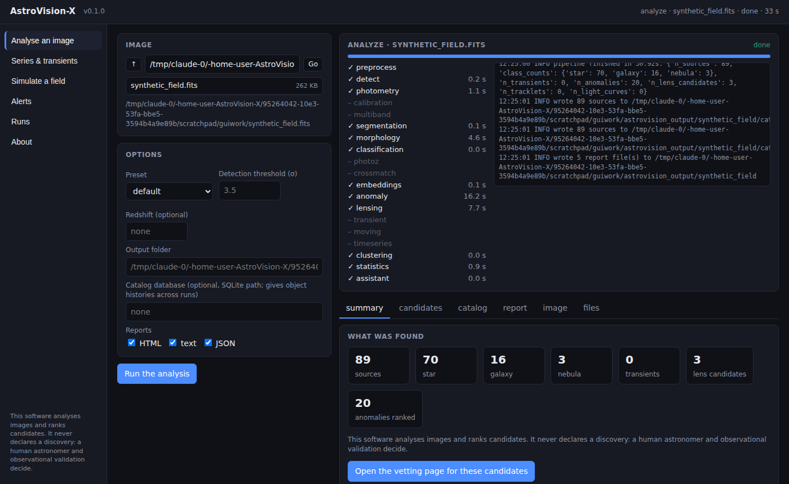
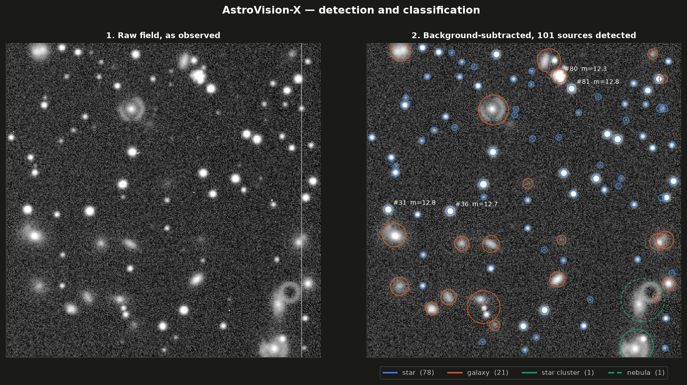
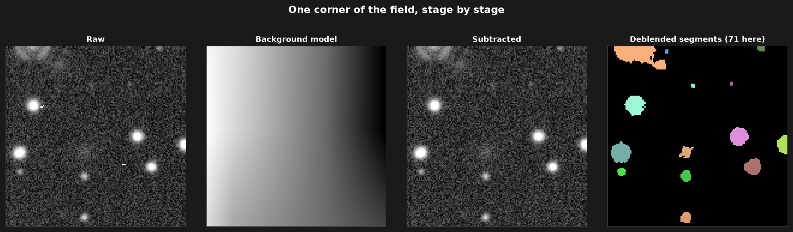
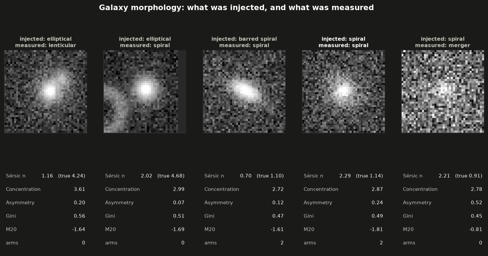
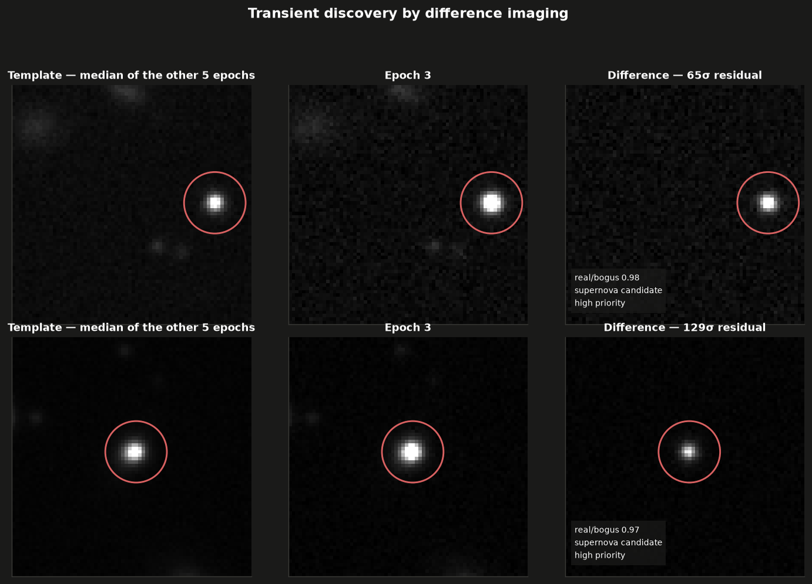
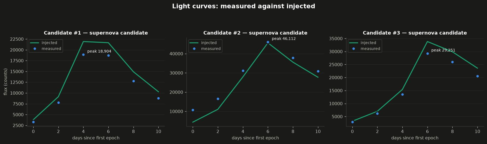
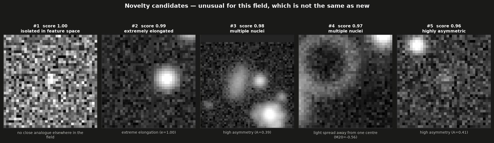
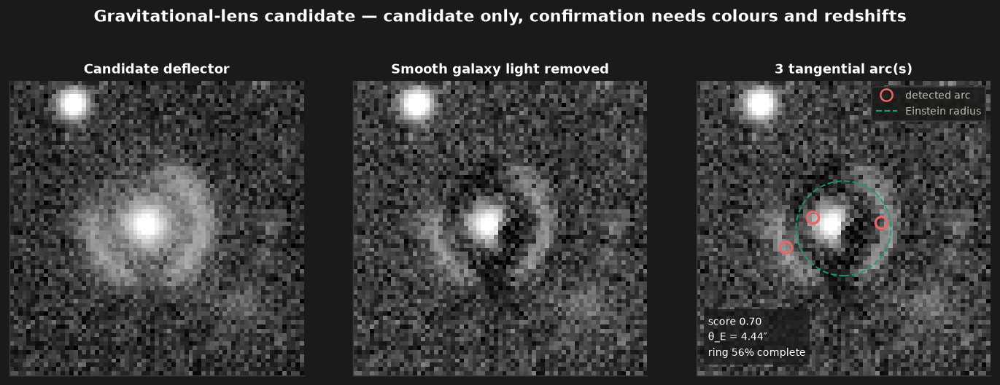
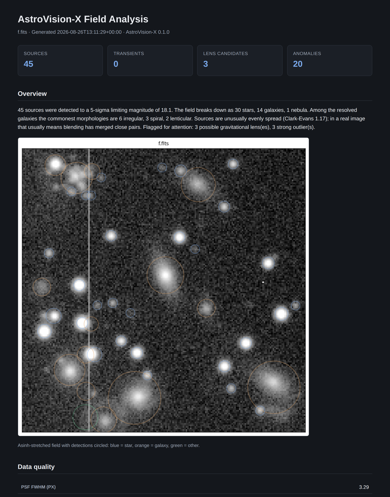

# AstroVision-X

**Advanced Computer Vision & Machine Learning Framework for Astronomical and
Astrophysical Analysis**

AstroVision-X takes telescope imagery and produces a scientific report. Sources
are detected and deblended, measured photometrically and morphologically,
classified, searched for novelty and for gravitational lensing and — given
several epochs — differenced for transients and characterised in the time
domain. A research assistant then ranks what a human should look at first and
says why.

> **The platform reports candidates, not discoveries.** A transient candidate
> needs an independent epoch and, for a supernova, a spectrum. A lens candidate
> needs colours and redshifts. An anomaly is an object unlike the rest of *this
> field*, which is not the same as an object unlike anything known. Every
> finding is written to make that boundary visible.

---

## Quick start

```bash
pip install -e ".[all]"          # NumPy is the only hard dependency
astrovision info                 # show which optional backends are present
```

```bash
# Generate a synthetic field with a ground-truth table, then analyse it
astrovision simulate --out field.fits --size 512 --galaxies 40 --lenses 1
astrovision analyze field.fits --report text,html -o results/

# Search a multi-epoch series for transients
astrovision simulate --out night.fits --epochs 6 --transients 3
astrovision series night_epoch*.fits -o results/
```

Or as a desktop application, with a file browser, a progress bar per stage,
and the report, catalog and cutouts in a window:

```bash
astrovision gui                  # opens http://127.0.0.1:8770/ in your browser
```



It runs on any PC: `pip install` where Python exists, one-click installers
in [`packaging/`](packaging/) for Windows, macOS and Linux, and standalone
builds that need no Python at all -- see [docs/gui.md](docs/gui.md).

```python
from astrovision import Pipeline, quick_field

image, truth = quick_field((512, 512))
analysis = Pipeline().run(image)

print(analysis.summary())
print(analysis.statistics["narrative"]["summary"])
for line in analysis.statistics["narrative"]["priority_text"][:3]:
    print(line)
```

```python
# Several filters of the same sky, and a check against what is already known
from astrovision import Pipeline
from astrovision.core.config import AstroVisionConfig
from astrovision.simulate import SkyConfig, SkySimulator
from astrovision.preprocess import Preprocessor

images, truth = SkySimulator(SkyConfig(seed=7)).generate_multiband(("g", "r", "i"))
bands = {name: Preprocessor().run(image) for name, image in images.items()}

config = AstroVisionConfig()
config.crossmatch.backend = "vizier"          # or "local" with a path, or "none"
config.crossmatch.cache_dir = ".astrovision-cache"
config.calibration.astrometry = True
config.calibration.photometry = True

analysis = Pipeline(config).run(bands["r"], bands=bands, preprocess=False)
for source in analysis.catalog:
    if "known" in source.flags:
        known = source.meta["known_object"]
        print(f"source {source.id} is {known['name']}, a {known['described_type']}")
```

---

## What it does

```
                      TELESCOPE / SURVEY DATA
                                │
                ┌───────────────┴───────────────┐
                │                               │
           2-D IMAGES                    TIME SERIES
                │                               │
                ▼                               ▼
        ┌───────────────┐              ┌────────────────┐
        │ PREPROCESSING │              │  REGISTRATION  │
        │ background    │              │  PSF matching  │
        │ cosmic rays   │              │  flux scaling  │
        │ PSF model     │              └───────┬────────┘
        └───────┬───────┘                      │
                ▼                              ▼
        ┌───────────────┐              ┌────────────────┐
        │   DETECTION   │              │  DIFFERENCE    │
        │ matched filter│              │    IMAGING     │
        │ deblending    │              └───────┬────────┘
        │ deep detector │                      │
        └───────┬───────┘                      ▼
                │                      ┌────────────────┐
                ▼                      │  REAL / BOGUS  │
        ┌───────────────┐              │    VETTING     │
        │ SEGMENTATION  │              └───────┬────────┘
        │ watershed     │                      │
        │ U-Net         │                      ▼
        │ galaxy parts  │              ┌────────────────┐
        └───────┬───────┘              │   TRANSIENT    │
                ▼                      │ CHARACTERISATION│
        ┌───────────────┐              │  light curves  │
        │  PHOTOMETRY   │              │  periodograms  │
        │ apertures     │              └───────┬────────┘
        │ Kron/Petrosian│                      │
        └───────┬───────┘                      │
                ▼                              │
        ┌───────────────┐                      │
        │  MORPHOLOGY   │                      │
        │ CAS, Gini/M20 │                      │
        │ Sérsic fit    │                      │
        │ arms and bars │                      │
        └───────┬───────┘                      │
                ▼                              │
        ┌───────────────┐                      │
        │CLASSIFICATION │                      │
        │ star / galaxy │                      │
        │ CNN, ViT      │                      │
        └───────┬───────┘                      │
                │                              │
      ┌─────────┼──────────┐                   │
      ▼         ▼          ▼                   │
  ┌───────┐ ┌───────┐ ┌────────┐               │
  │ANOMALY│ │LENSING│ │ASTRO-  │               │
  │isol.  │ │ arcs  │ │PHYSICS │               │
  │forest │ │ rings │ │ counts │               │
  │autoenc│ │ θ_E   │ │ cosmo  │               │
  └───┬───┘ └───┬───┘ └───┬────┘               │
      └─────────┼─────────┴────────────────────┘
                ▼
        ┌────────────────────┐
        │  RESEARCH ENGINE   │
        │  priority ranking  │
        │  narrative + why   │
        └─────────┬──────────┘
                  ▼
        ┌────────────────────┐
        │ SCIENTIFIC REPORT  │
        │  text / JSON / HTML│
        │  + source catalog  │
        └────────────────────┘
```

### Computer vision

| Task | Method |
| --- | --- |
| Source detection | Matched-filter thresholding on a 2-D background mesh |
| Deblending | Multi-threshold tree with flux-contrast pruning |
| Deep detection | Anchor-free CenterNet-style detector (PyTorch, optional) |
| Segmentation | Marker-controlled watershed; U-Net semantic labels |
| Galaxy decomposition | Nucleus / bulge / disc / outskirts from the curve of growth |
| Stamp classification | Residual CNN and a compact Vision Transformer |

### Measurement

| Quantity | Method |
| --- | --- |
| Flux | Sub-pixel apertures with a PSF aperture correction |
| Adaptive aperture | Kron and Petrosian radii from the curve of growth |
| Concentration | `C = 5 log₁₀(r₈₀/r₂₀)` |
| Asymmetry, smoothness | Conselice CAS, with the rotation centre minimised |
| Gini, M₂₀ | Lotz statistics over a Petrosian-defined footprint |
| Sérsic index | PSF-convolved 2-D fit, radius pinned by the measured `r₅₀` |
| Spiral arms | Fourier modes in log-polar space, confirmed by phase winding |
| Bars | The same `m = 2` mode, distinguished by *constant* phase |

### Multiple filters

| Task | Method |
| --- | --- |
| Forced photometry | One aperture, defined once, applied at the same *sky* position in every band |
| Seeing homogenisation | Every band convolved to the worst PSF in the set, in arcsec |
| Colours | Recorded only when both bands clear a signal-to-noise floor; one-sided limits otherwise |
| Stellar locus | Fitted from the field's own point sources, not from a table |
| Photometric redshift | Template fit over a redshift grid, with a bimodal posterior reported |
| Colour classification | Likelihood ratio between two field-calibrated populations |

### Calibration

| Task | Method |
| --- | --- |
| Plate solution | Iterative mutual-nearest matching, then a linear fit in the tangent plane |
| Distortion | SIP forward coefficients, inverse by fixed-point iteration |
| Zero point | Robust fit against catalogued standards, with a colour term |
| Known objects | One cone search per field against Gaia / SIMBAD / a local file |
| Uncertainty | Parameter covariance from the fit; parametric bootstrap for the rest |
| Probabilities | Isotonic or Platt calibration, chosen by how much labelled data there is |

### Discovery

| Search | Method |
| --- | --- |
| Transients | Hold-one-out templates, PSF matching, veto-style real/bogus vetting |
| Solar-system objects | Tracklet linking across epochs, confirmed by within-exposure trails |
| Variability | Reduced χ², Stetson J, von Neumann η, Lomb–Scargle periods |
| Novelty | Isolation forest + autoencoder + k-NN isolation, rank-combined |
| Strong lensing | Tangential arcs at a shared radius; radial scan for full rings |
| Lens mass models | Isothermal ellipsoid + external shear fitted to arc positions, Einstein mass |
| Spectroscopy | Long-slit extraction, arc calibration, cross-correlation redshifts, line fitting, BPT and supernova typing |
| Transfer learning | Loaders for survey cutouts and alert stamps; measured cost of an instrument change and what it takes to recover |
| Explainability | Occlusion and Grad-CAM saliency, Shapley attributions, nearest-neighbour retrieval — each checked against the model's own behaviour |
| Self-supervision | Contrastive pretraining on unlabelled cutouts, with astronomy-appropriate augmentations |
| Human-in-the-loop | Reviewer verdicts recorded as labels, model/reviewer agreement tracked, retraining loop |
| Populations | Number counts, completeness turnover, Landy–Szalay clustering |

---

## Measured performance

Every number below is measured against the simulator's ground truth by the
test suite, on fields with realistic Poisson and read noise, cosmic rays and
bad columns. They are *not* claims about real survey data. What three real
images (a DSS plate, a Spitzer mosaic, an IRAC stamp) did to the code, and
the numbers they gave against photutils and SEP, are in
[docs/validation.md](docs/validation.md#real-images).

| Capability | Result |
| --- | --- |
| Detection recall (S/N > 10) | 93 % |
| Spurious detection rate | 1–3 % at 3.5 σ |
| Astrometric precision | 0.15 px median |
| Photometric accuracy (isolated stars) | within 3 %, 3 % scatter |
| PSF FWHM recovery | 6 % median error |
| Centre-to-corner photometry gap | 2.2 % → 0.1 % with a position-dependent PSF |
| Sérsic index recovery | 11 % median error |
| Star/galaxy separation | 90 % (100 % for galaxies at S/N > 10) |
| Multi-band colour accuracy | −0.009 mag bias, 0.060 mag scatter at S/N > 15 |
| Astrometric solution | 3.5″ header error → 0.047″, 0.110″ rms |
| Photometric zero point | 24.987 ± 0.002 against a true 25.000 |
| Probability calibration | expected calibration error 0.112 → 0.027 |
| Spectroscopic redshift | 7 × 10⁻⁵ in Δz/(1+z) — about 21 km/s |
| Spectroscopic redshift purity | 1.00 at S/N ≥ 8, 0.91 at 5, 0.25 at 3 |
| Wavelength solution | 0.10 Å rms against truth, from a 26-line arc |
| Line ratios ([N II]/Hα) | within 2 % of the drawn value |
| BPT classification | 7/7 across the ionisation sequence |
| Supernova typing | 30/36 typed, all 30 correct, 0 wrong |
| Photometric redshift (5 filters) | scatter 0.015 in Δz/(1+z), 2.8 % outliers |
| Agreement with photutils and SEP | 0.06–0.08 px, 0.2–0.3 % in flux where both detect |
| Tiled vs whole-image catalog | 0.002 px, 0.1–1 % in flux, memory 191 → 23 MB |
| Aperture photometry, 4096² frame | 1817 ms → 0.31 ms per aperture, identical to 4 × 10⁻¹⁶ |
| Catalog database, 500k detections | cone search 2.5 ms at 5″, object history 0.13 ms |
| Avro alert codec (stdlib) | byte-for-byte interchange with fastavro, both directions |
| HEALPix index | exact agreement with healpy, nside 1 to 256 |
| Gini and M20 vs statmorph | 0.01–0.04 scatter, rank correlation 0.7–0.9 |
| Asymmetry vs statmorph | rank correlation −0.8 → +0.6 after the sky correction |
| Photometric redshift (3 filters) | scatter 0.043, 22 % outliers — the filter count dominates |
| Galaxy morphology (5 classes) | 59 % exact, 78 % at family level |
| Transient recall | 12/14, with 2 spurious over five fields |
| Moving-object recall | 10/10, 0 spurious over ten fields |
| Strong-lens recall | 4/15, with 9 false positives over five fields (ray-traced arcs) |
| Lens model on exact constraints | θ_E, axis ratio, angle and shear all recovered |
| Lens model on detected arcs | θ_E 20 % median error, axis ratio 0.13 |
| CNN stamp classification | 85 % on a 266-stamp training set |
| Cost of an instrument change | 0.92 → 0.70 balanced accuracy, a 23-point drop |
| Recovery from 25 target labels | 0.795 ± 0.059, against 0.28 trained from scratch |
| Saliency faithfulness (occlusion) | beats chance on 37/40 stamps; Grad-CAM on 21/40 |
| Shapley attributions | informative features 100× above noise features |
| Anomaly retrieval | 86 % same-class neighbours against a 35 % chance rate |
| Self-supervised probe, 100 labels | 0.764 ± 0.008 against 0.655 ± 0.146 from scratch |
| Active-learning selection | random beat uncertainty sampling at 3 of 4 budgets |
| LSTM light-curve classification | 92 % over six variability classes |

Known limits, stated plainly: nebula and star-cluster classification is weak
(they overlap galaxies in every measured statistic); the PSF is unreliable in
fields where galaxies outnumber stars several to one, and the pipeline warns
when that happens; formal photometric errors run about 2.5 times too small,
because they count photon and read noise but not sky estimation, blending or
PSF-matching residuals; and Sérsic fits are effectively degenerate in
`n` against `r_eff`, which is why they carry a correlation and a flag rather
than a bare index.

The transfer numbers deserve their caveat stated first: **no real survey data
was used anywhere in this project.** Nothing outside the package registries
was reachable from the environment it was built in, so the loaders for survey
cutouts and alert stamps are exercised against files written in those formats,
and the cost of changing instrument is measured between two *simulated* ones.
The method and the shape of the answer are real; a number for SDSS or ZTF is
not, and would need the data to obtain.

Two spectroscopic limits belong in the same paragraph as the numbers above.
Below signal-to-noise about 5 per pixel the redshift reliability flag stops
meaning anything — purity falls to 0.25 — because a catastrophic failure at
that depth is not a weak correlation but a confident match to the wrong
feature. And the winning template is not a classification: a quasar here is
matched by the starburst template and still gets the right redshift, which is
the correlation working as designed rather than failing.

The lens numbers changed for a reason worth naming. Simulated lenses now
produce their arcs by **ray tracing through a mass model** instead of having
them painted at a chosen radius, and recall against them is 4/15 rather than
the 8/14 measured against painted arcs. The search did not get worse — the
test stopped drawing the answer for it. Ray-traced systems often show one
faint image where a painted one showed a tidy pair, and single-arc detections
are also where the false positives come from.

Colour is the case worth spelling out. Adding it to star/galaxy separation
changes 93.9 % to 93.7 % — one object in 442, which is to say nothing. At
this depth the colour errors are comparable to how far galaxies sit off the
stellar locus, so there is little to learn, and the machinery says so: it
measures its own separation on each field and weights itself accordingly,
down to zero. In a deeper variant the same code gives 94.1 % → 95.1 %. The
capability is there and self-gating; the honest claim today is that it costs
nothing and will pay off with better photometry.

---

## Gallery

Every image below is produced by `examples/04_make_figures.py`, which runs the
real pipeline on a simulated field and plots what each stage returned. Nothing
is drawn by hand.

| | |
| --- | --- |
|  | **Detection and classification.** The field before and after background subtraction, with every detection circled and coloured by class. |
|  | **Preprocessing.** Raw frame, the fitted background model, the subtracted image, and the deblended segmentation. |
|  | **Galaxy morphology.** Injected type against measured type, with Sérsic *n*, concentration, asymmetry, Gini/M20 and arm count. |
|  | **Transient search.** Template, new epoch and difference, held on a single intensity scale so the residual is comparable to the source it came from. |
|  | **Light curves.** Photometry recovered from the epoch stack, against the injected curve. |
|  | **Novelty search.** The highest-ranked outliers, each with the written reason it was flagged. |
|  | **Lens candidate.** Deflector, the same cutout with smooth galaxy light removed, and the tangential arcs with a fitted Einstein radius. |
|  | **The written report.** What the research assistant produces for a field, including the ranked follow-up list. |

---

## Installation

```bash
pip install -e .                 # core: NumPy only
pip install -e ".[science]"      # + SciPy, Astropy
pip install -e ".[ml]"           # + scikit-learn
pip install -e ".[deep]"         # + PyTorch
pip install -e ".[all]"          # everything except PyTorch
pip install -e ".[benchmark]"    # + photutils, SEP, for comparing catalogs
```

For a PC without a Python environment to hand, `packaging/install.bat`
(Windows) and `packaging/install.sh` (macOS, Linux) create a private one,
install the application into it and add a launcher to the Desktop, Start
Menu or applications menu; the `Desktop builds` workflow produces
standalone folders that need no Python at all. Details in
[docs/gui.md](docs/gui.md).

Optional dependencies enable *features*, never whole subsystems. Without
Astropy, FITS still reads and writes through a self-contained parser; without
SciPy, labelling, filtering and fitting fall back to NumPy; without PyTorch,
the deep detector, U-Net and CNN classifiers raise a clear error and the
classical paths carry on. Run `astrovision info` to see what is active.

---

## Configuration

```bash
astrovision analyze field.fits --preset deep_field \
    --set detection.threshold_sigma=2.5 \
    --set anomaly.contamination=0.01
```

Presets: `deep_field`, `wide_survey`, `transient_search`, `lens_search`,
`quicklook`. The full configuration is written into every report, so a result
can always be reproduced.

```python
from astrovision import AstroVisionConfig, Pipeline

config = AstroVisionConfig().with_preset("transient_search")
config.detection.threshold_sigma = 4.0
config.transient.real_bogus_threshold = 0.8      # purity over completeness
analysis = Pipeline(config).run_series(series)
```

---

## Working with real data

```python
from astrovision import AstroImage, ImageSeries, Pipeline

image = AstroImage.from_fits("survey_r.fits")          # WCS, band, MJD from the header
analysis = Pipeline().run(image, redshift=0.34)

series = ImageSeries.from_paths(sorted(glob.glob("epoch_*.fits")))
analysis = Pipeline().run_series(series)
```

The pipeline reads the zero point from `MAGZP`, the gain from `GAIN` and the
saturation level from `SATURATE` when present, and falls back to configured
values otherwise. Every assumption it had to make is listed in the report,
and so is anything the data cannot support: a PSF under two pixels FWHM, or
pixels with no zero point, each get a warning that says what not to trust.

Catalog coordinates are ICRS. A header in another frame or projection (a
Galactic-coordinate mosaic, a DSS plate solution, a `TPV` polynomial) is
refitted to an ICRS tangent plane through astropy and the residual is kept in
`image.wcs.derived_from`; without astropy such a header is read as written
and labelled with its own axes rather than mislabelled as equatorial.

Survey products come as several planes, and those are read as such:

```python
from astrovision.io import load_survey_image
from astrovision.engine.tiles import process_tiled, standard_stage

image, report = load_survey_image("c4d_r_ooi.fits.fz")   # SCI + MASK + WEIGHT
print(report.notes)                                      # what the loader assumed

result = process_tiled(image, standard_stage(), tile=2048, overlap=128)
catalog = result.catalog                                 # a 16k frame in 2k tiles
```

The data-quality plane becomes the mask, the weight plane becomes the noise
model, pixels already in electrons are recognised so the gain is not applied
twice, and a frame too large to hold in memory several times over is processed
in overlapping tiles and merged into one catalog. Add `--db survey.sqlite`
to `astrovision analyze` and every field's catalog goes into one SQLite
store with a HEALPix sky index, where detections of the same position across
fields and epochs are linked into objects with histories:

```bash
astrovision db survey.sqlite cone 150.1 2.2 30      # everything within 30" of a position
astrovision db survey.sqlite history 1234           # one object's detections over time
astrovision vet field.fits --log verdicts.json      # a page where an astronomer decides
astrovision vet alerts.avro --log verdicts.json     # the same page on an alert file, as received
astrovision series epoch_*.fits --alerts out.avro   # transients as Avro alerts (ZTF vocabulary)
astrovision alerts tns out.avro --reporter "Name"   # a TNS report drafted, never sent
```

The vetting page shows one candidate at a time with its cutouts, evidence
and history; a verdict is one keystroke and is recorded under the reviewer's
name beside what the model said. Given an alert file instead of an image it
shows the packets as they came -- their cutouts, light curves and scores --
so a broker's stream can be vetted with the same keys. Alerts are written and read in the
community's Avro formats with a standard-library codec, and a Transient Name
Server report can be drafted from one, with a named reporter, for a person to
submit. Every run carries a manifest
(configuration hash, code revision, dependency versions, seeds, input
checksums) and a digest of its catalog, so a repeat run can be checked against
it. With `pip install -e ".[benchmark]"` the catalog can be compared with
photutils and SEP on the same pixels.

---

## Vetting

```bash
astrovision vet field.fits --log verdicts.json --db survey.sqlite
```

opens a local page that shows the ranked candidates one at a time, with the
cutout, the background-subtracted cutout, the pipeline's evidence and caveats
and the object's history across epochs. One key records a verdict under the
reviewer's name, next to what the model said, into the same append-only log
the active-learning loop trains from. No name, no verdict: this is the
boundary the whole project keeps, implemented as a refused request.

---

## Documentation

- [`docs/architecture.md`](docs/architecture.md) — how the stages fit together
- [`docs/methods.md`](docs/methods.md) — the science behind each measurement
- [`docs/validation.md`](docs/validation.md) — how each number above was measured
- [`docs/api.md`](docs/api.md) — the Python API
- [`docs/gui.md`](docs/gui.md) — the desktop application and how to install it on any PC
- [`examples/`](examples/) — runnable end-to-end scripts

---

## Development

```bash
pip install -e ".[all,dev]"
pytest                           # the full suite
pytest -m "not slow" -q          # quick run
ruff check astrovision tests --select F,E9
```

Continuous integration runs the suite in every environment the package
claims to support, because "optional" is only true if it is tested:
NumPy alone, NumPy 1.21 (the floor), the science stack, scikit-learn,
PyTorch, and everything together with the benchmark tools, across Python
3.9 to 3.12. Each job reports what it skipped, so a test that silently skips
everywhere shows up in the summary.

## License

MIT — see [LICENSE](LICENSE).
